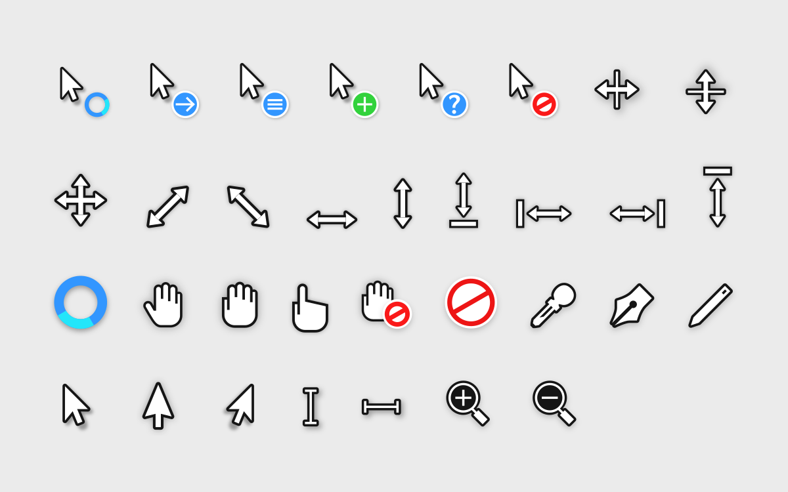

# Win10XOS cursors
This is a (fairly shoddy) port of an x-cursor theme based on WinOS to Windows.

## Installation
To install, simply extract the zip file under releases, and right-click the "install.inf" file. 
Press ok, and it should be in your cursor options!!
## Preview

(Certain Cursors displayed in this image may not be available in the windows version.)